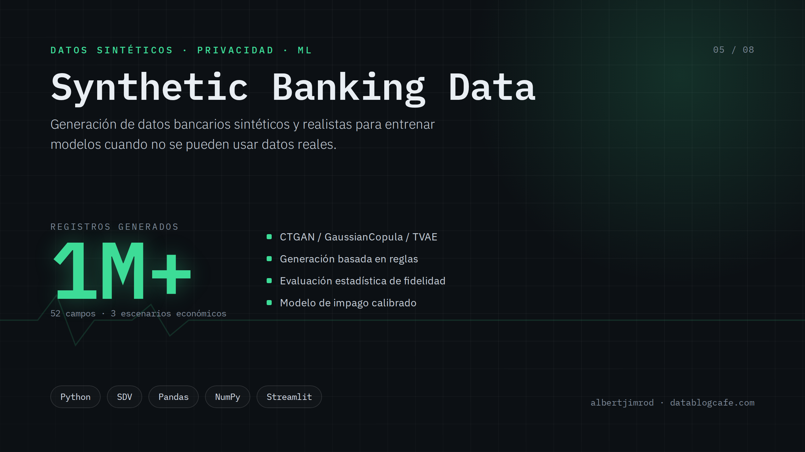
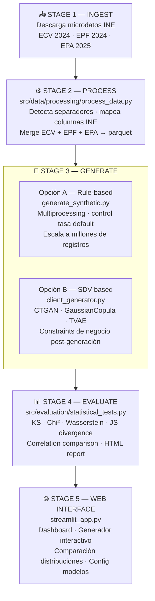

<div align="center">
  
</div>

---

# synth-bank-es

A full pipeline to generate **realistic synthetic banking datasets for the Spanish market**, trained on real microdata from official sources (INE — Instituto Nacional de Estadística). Designed for credit risk model development, regulatory compliance testing, and ML research where real customer data cannot be used.

---

## Why this project exists

Training credit scoring or default prediction models requires large, realistic datasets. Real banking data is restricted by GDPR and internal compliance policies. This pipeline solves that by:

1. **Ingesting real statistical microdata** from INE (ECV, EPF, EPA surveys) — not invented numbers, but actual population distributions
2. **Training generative models** (CTGAN, GaussianCopula, VAE) on that real data
3. **Producing unlimited synthetic customers** whose statistical properties match the Spanish population

The result is a dataset that is statistically indistinguishable from real banking data, but contains no real individuals.

---

## Pipeline overview



---

## Directory structure

```
synth-bank-es/
│
├── src/                                  # All source code
│   ├── data/
│   │   ├── processing/
│   │   │   └── process_data.py           # INE microdata processor
│   │   ├── cleaning/                     # Data cleaning utilities (extendable)
│   │   ├── ingestion/                    # Data ingestion utilities (extendable)
│   │   └── utils/
│   │
│   ├── synthetic/
│   │   ├── generators/
│   │   │   ├── generate_synthetic.py     # Rule-based generator (large scale, multiprocessing)
│   │   │   └── client_generator.py       # SDV-based generative model generator
│   │   ├── models/                       # Trained model storage (extendable)
│   │   ├── constraints/                  # Business rule constraints (extendable)
│   │   └── utils/
│   │
│   ├── evaluation/
│   │   └── statistical_tests.py          # Statistical quality evaluation
│   │
│   ├── scoring/                          # Credit scoring models (extendable)
│   ├── visualization/                    # Plotting utilities (extendable)
│   └── utils/
│
├── data/
│   ├── raw/                              # Raw INE microdata — NOT in git (see below)
│   │   ├── ecv/                          # ECV 2024 — Encuesta de Condiciones de Vida
│   │   ├── epf/                          # EPF 2024 — Encuesta de Presupuestos Familiares
│   │   └── epa/                          # EPA 2025 T3 — Encuesta de Población Activa
│   │
│   ├── processed/                        # Parquet files — INCLUDED in repo (~11 MB total)
│   │   ├── ecv_processed.parquet         # Processed living conditions data (4.8 MB)
│   │   ├── epf_processed.parquet         # Processed family budget data (3.3 MB)
│   │   ├── epa_processed.parquet         # Processed labour force data (2.6 MB)
│   │   └── combined_base.parquet         # Merged training base (466 KB)
│   │
│   └── synthetic/                        # Generated synthetic datasets (runtime output)
│
├── configs/
│   ├── data_config.yaml                  # Data pipeline configuration
│   └── model_config.yaml                 # Generative model hyperparameters
│
├── notebooks/
│   └── 02_data_processing/
│       ├── 01_eda_N_50K.ipynb            # EDA on 50K synthetic sample
│       └── credit_scoring.ipynb          # Credit scoring model notebook
│
├── models/                               # Saved trained models (.pkl) — not in git
├── reports/
│   └── evaluation_reports/               # HTML evaluation reports (runtime output)
├── logs/                                 # Runtime logs
├── tests/                                # Test suite
│
├── streamlit_app.py                      # Web interface
├── requirements.txt                      # Python dependencies
├── setup.py                              # Package setup
├── pyproject.toml                        # Project metadata
├── .env.example                          # Environment variables template
└── .gitignore
```

---

## Scripts in detail

### `src/data/processing/process_data.py`

Reads the raw INE microdata files from `data/raw/` and produces clean parquet files in `data/processed/`.

**What it does:**
- Auto-detects file separators (tab, comma, semicolon) — INE distributes data in `.tab` CSV format
- Maps raw INE column codes to human-readable names:
  - ECV: `PB140` → `edad`, `PB150` → `sexo`, `DB040` → `ccaa`, `PE040` → `nivel_estudios`, `HY020` → `renta`, `PL031` → `situacion_laboral`
  - EPF: `ccaa`, `n_miembros`, `gasto_total`, `gasto_monetario`, `regimen_vivienda`
  - EPA: `edad`, `sexo`, `ccaa`, `situacion_laboral`, `ocupacion`, `sector`, `tramo_salario`
- Merges the three surveys into a single `combined_base.parquet` used as training input

**Input:** `data/raw/ecv/`, `data/raw/epf/`, `data/raw/epa/`
**Output:** `data/processed/ecv_processed.parquet`, `epf_processed.parquet`, `epa_processed.parquet`, `combined_base.parquet`

---

### `src/synthetic/generators/generate_synthetic.py`

Rule-based synthetic customer generator. Produces full banking profiles from the processed base data. Designed for large-scale generation (hundreds of thousands to millions of records) using multiprocessing.

**What it does:**
- Loads `combined_base.parquet` as the demographic base
- For each customer record, generates:
  - Full personal identity: name, DNI, IBAN, email, phone, address (Spain-specific)
  - Realistic income, expenses and savings distributions per CCAA
  - Bank accounts (corriente, ahorro, inversión) with balances
  - Credit cards with limits and utilization ratios
  - Loans (hipotecario, consumo) with amortization schedules
  - Investment portfolios (fondos, acciones, ETFs, planes de pensiones)
  - Insurance policies (vida, auto, hogar, salud)
  - 12 months of transaction history with categories
  - Credit contracts and banking history
- Computes default probability using a logit model based on: income, age, savings rate, debt-to-income ratio, employment stability
- Supports **target default rate control** (e.g. generate a dataset with exactly 5% default rate)
- Parallel processing via `multiprocessing` with configurable number of cores and batch size

**Usage (interactive CLI):**
```bash
python src/synthetic/generators/generate_synthetic.py
# Prompts for: number of records, target default rate, CPU cores, batch size
```

**Output:** CSV in `data/synthetic/` with full flat banking records

---

### `src/synthetic/generators/client_generator.py`

SDV-based (Synthetic Data Vault) generative model generator. Trains a machine learning generative model on the processed data and samples new synthetic customers from it.

**What it does:**
- Loads real processed data and validates required columns
- Prepares SDV metadata (column types, primary keys, constraints)
- Trains one of three generative methods:
  - **CTGAN** (Conditional Tabular GAN) — best for mixed numeric/categorical data
  - **GaussianCopula** — fast, captures correlations well, good baseline
  - **VAE** (Variational Autoencoder) — deep learning approach
- Applies post-generation business constraints:
  - Minimum age 18, maximum ~100
  - Non-negative account balances
  - Debt-to-income ratio max 40%
  - Employment-age consistency (jubilado ≥ 60 years)
  - Minimum loan amounts by type (hipoteca ≥ 50,000€)
- Saves versioned output: CSV + `.pkl` model + JSON metadata (timestamp, method, seed, shape)

**Usage (Python API):**
```python
from src.synthetic.generators.client_generator import ClientGenerator

generator = ClientGenerator(n_samples=10000, method='ctgan', seed=42)
real_data = generator.load_real_data('data/processed/combined_base.parquet')
generator.fit(real_data)
synthetic = generator.generate(apply_constraints=True)
generator.save('data/synthetic/v1_20260307', synthetic, save_model=True)
```

**Supported methods:** `'ctgan'`, `'copula'`, `'vae'`

---

### `src/evaluation/statistical_tests.py`

Evaluates how statistically similar the synthetic data is to the real data.

**Tests performed:**
| Test | Applies to | What it measures |
|------|-----------|-----------------|
| Kolmogorov-Smirnov | Numeric columns | Whether distributions are the same |
| Chi-square | Categorical columns | Whether category frequencies match |
| Wasserstein distance | Numeric columns | "Earth Mover's Distance" between distributions |
| Jensen-Shannon divergence | All columns | Symmetric divergence, range [0,1] |
| Correlation comparison | Full dataset | Whether variable relationships are preserved |
| Descriptive stats | Full dataset | Side-by-side mean/std/percentile comparison |

**Quality thresholds (Wasserstein):**
- < 0.05 → Excellent
- 0.05–0.10 → Good
- 0.10–0.20 → Acceptable
- \> 0.20 → Poor

**Usage:**
```python
from src.evaluation.statistical_tests import StatisticalTests

evaluator = StatisticalTests(real_data, synthetic_data, alpha=0.05)
results = evaluator.run_all_tests()
evaluator.generate_report('reports/evaluation_reports/')
```

---

### `streamlit_app.py`

Web dashboard for non-technical users. Runs in the browser.

**Tabs:**
- **Dashboard** — Summary metrics and recent generation activity
- **Data Generator** — Upload training data, choose method (CTGAN/Copula/VAE), configure parameters, generate and download
- **Evaluation** — Upload real and synthetic datasets, run tests, view distribution comparison charts
- **Settings** — Configure model hyperparameters (epochs, batch size, latent dimensions)

**Usage:**
```bash
streamlit run streamlit_app.py
# Opens at http://localhost:8501
```

---

## Raw data — what goes in `data/raw/`

The raw microdata is **not included in this repository** because the files are large (up to 100 MB each) and distributed in multiple binary formats (SPSS, SAS, STATA). Download them directly from INE:

### ECV 2024 — Encuesta de Condiciones de Vida
`data/raw/ecv/`

Download from: [https://www.ine.es/dyngs/INEbase/es/operacion.htm?c=Estadistica_C&cid=1254736176807&menu=resultados&idp=1254735976608](https://www.ine.es/dyngs/INEbase/es/operacion.htm?c=Estadistica_C&cid=1254736176807&menu=resultados&idp=1254735976608)

Files needed (CSV/TAB format):
```
ecv/
├── ECV_Tp_2024.tab      # Personas (individuals)
├── ECV_Th_2024.tab      # Hogares (households)
└── ECV_Tr_2024.tab      # Renta (income)
```

### EPF 2024 — Encuesta de Presupuestos Familiares
`data/raw/epf/`

Download from: [https://www.ine.es/dyngs/INEbase/es/operacion.htm?c=Estadistica_C&cid=1254736176806&menu=resultados&idp=1254735976608](https://www.ine.es/dyngs/INEbase/es/operacion.htm?c=Estadistica_C&cid=1254736176806&menu=resultados&idp=1254735976608)

Files needed (CSV/TAB format):
```
epf/
├── EPFhogar_2024.tab        # Household data
├── EPFgastos_2024.tab       # Expenditure data
└── EPFmhogar_2024.tab       # Member data
```

### EPA 2025 T3 — Encuesta de Población Activa
`data/raw/epa/`

Download from: [https://www.ine.es/dyngs/INEbase/es/operacion.htm?c=Estadistica_C&cid=1254736176918&menu=resultados&idp=1254735976596](https://www.ine.es/dyngs/INEbase/es/operacion.htm?c=Estadistica_C&cid=1254736176918&menu=resultados&idp=1254735976596)

Files needed (CSV/TAB format):
```
epa/
└── EPA_2025T3.tab           # Labour force microdata
```

> **Note:** The `data/processed/` parquet files are already included in the repository. If you only want to generate synthetic data, you can skip downloading raw files and go directly to Stage 3.

---

## Quick start

### 1. Clone and install

```bash
git clone https://github.com/albertjimrod/synth-bank-es.git
cd synth-bank-es
conda create -n synth-bank-es python=3.11
conda activate synth-bank-es
pip install -r requirements.txt
```

### 2. Configure environment

```bash
cp .env.example .env
# Edit .env with your paths if needed
```

### 3a. Generate synthetic data immediately (processed data already included)

```bash
# Rule-based generator (fast, large scale)
python src/synthetic/generators/generate_synthetic.py

# Or using the generative model (trains CTGAN on the included parquet files)
python -c "
from src.synthetic.generators.client_generator import ClientGenerator
gen = ClientGenerator(n_samples=10000, method='ctgan', seed=42)
data = gen.load_real_data('data/processed/combined_base.parquet')
gen.fit(data)
synthetic = gen.generate()
gen.save('data/synthetic/v1', synthetic)
"
```

### 3b. Reprocess raw INE data (optional, if you want to refresh from source)

```bash
# After placing raw files in data/raw/ecv/, data/raw/epf/, data/raw/epa/
python src/data/processing/process_data.py
```

### 4. Evaluate synthetic data quality

```python
import pandas as pd
from src.evaluation.statistical_tests import StatisticalTests

real = pd.read_parquet('data/processed/combined_base.parquet')
synthetic = pd.read_csv('data/synthetic/your_output.csv')

evaluator = StatisticalTests(real, synthetic)
evaluator.run_all_tests()
evaluator.generate_report('reports/evaluation_reports/')
```

### 5. Run the web interface

```bash
streamlit run streamlit_app.py
```

---

## Configuration

### `configs/data_config.yaml`
Controls the data pipeline: INE API endpoints, storage paths, data quality validation rules, feature encoding (label/onehot), scaling (standard/minmax/robust), Spanish demographic distributions, financial risk profiles, and GDPR compliance settings.

### `configs/model_config.yaml`
Controls generative model behaviour:
- **CTGAN**: epochs, batch size, generator/discriminator dimensions
- **GaussianCopula**: correlation type
- **VAE**: latent dimensions, encoder/decoder architecture
- **Business constraints**: min/max values, ratio limits, category validation
- **Evaluation thresholds**: KS, Wasserstein, JS divergence pass/fail criteria

---

## Requirements

```bash
pip install -r requirements.txt
```

**Core dependencies:**

| Library | Version | Purpose |
|---------|---------|---------|
| Python | 3.11 | Runtime |
| pandas | ≥ 2.0.0 | Data processing |
| numpy | ≥ 1.24.0 | Numerical operations |
| scipy | ≥ 1.11.0 | Statistical tests |
| scikit-learn | ≥ 1.3.0 | ML utilities |
| sdv | ≥ 1.9.0 | Synthetic Data Vault (CTGAN, Copula) |
| ctgan | ≥ 0.7.0 | Conditional GAN for tabular data |
| streamlit | ≥ 1.28.0 | Web interface |
| plotly | ≥ 5.17.0 | Interactive charts |
| loguru | ≥ 0.7.0 | Logging |
| pyyaml | ≥ 6.0 | Config file parsing |
| python-dotenv | ≥ 1.0.0 | Environment variables |
| tqdm | ≥ 4.66.0 | Progress bars |

---

## Data sources

| Survey | Organism | Year | What it contributes |
|--------|---------|------|---------------------|
| ECV — Encuesta de Condiciones de Vida | INE | 2024 | Age, education, income, employment status, household type |
| EPF — Encuesta de Presupuestos Familiares | INE | 2024 | Spending patterns by category, housing regime, household size |
| EPA — Encuesta de Población Activa | INE | 2025 Q3 | Employment status, occupation, sector, salary bracket |
